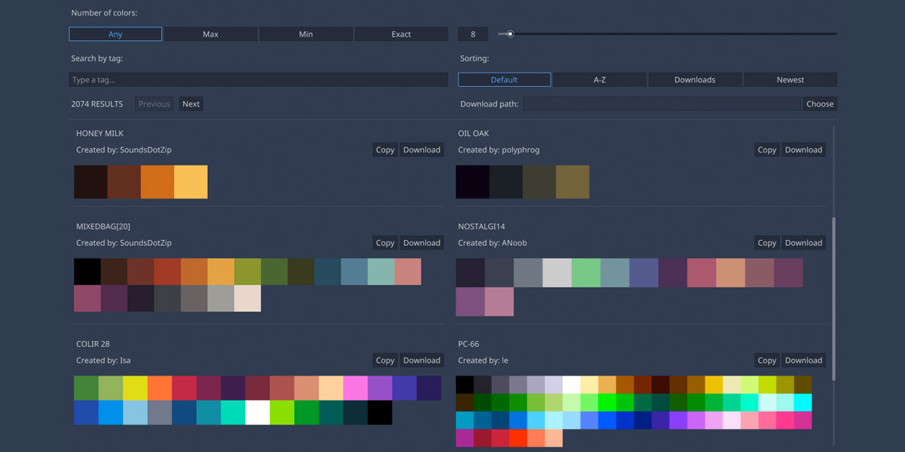

# Godot Plugin Lospec

Browse through thousands of awesome [Lospec palettes](https://lospec.com/palette-list) right inside the Godot editor.

Made for the [Godot Addons Jam #1](https://itch.io/jam/godot-addons-jam-1).

## 📌 Features:

- Copy palettes into the clipboard as an array.
- Download palettes as an image.

## 🛠️ Installation

- Clone the repository or download it in a ZIP file.
- Copy the `addons/lospec_palette_list` folder to the `addons` folders in your project.
- Enable the plugin by going to `Project > Project Settings > Plugins > Lospec Palette List > Enable`.
- A new tab called "Lospec Palette List" will appear at the top of the editor, next to "2D, 3D, Scripts, AssetLib".

## 🗒️ Changelog

See [CHANGELOG](/CHANGELOG.md).

## 👤 Author

- hiulit

## 🤝 Contributing

Feel free to:

- [Open an issue](https://github.com/hiulit/Godot-Plugin-Lospec/issues) if you find a bug.
- [Create a pull request](https://github.com/hiulit/Godot-Plugin-Lospec/pulls) if you have a new cool feature to add to the project.

## 🙌 Supporting this project

If you find this project helpful, please consider supporting it through any size donations to help make it better.

If you can't, consider sharing it with the world...

... or giving it a [star](https://github.com/hiulit/Godot-Plugin-Lospec/stargazers).

Thank you very much!

## 📝 Licenses

- Source code: [MIT License](/LICENSE).
